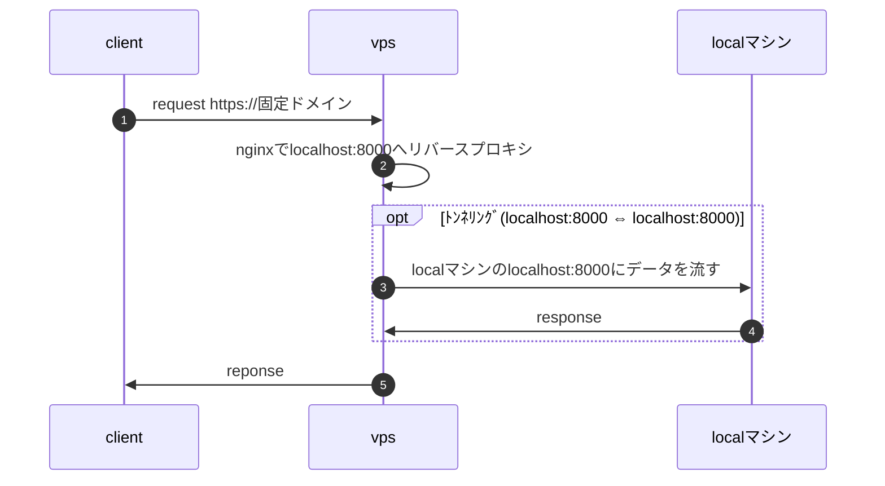

# はじめに
web開発は`ssl化された固定ドメインでweb公開されている状態`で開発したいと思う方が多いと思います。
その理由は外部サービスやブラウザ側で用意されているapiを叩く際にssl化された固定ドメインでないと動かなかったり、スマホで動作確認したいような場面によく遭遇するからです。
ngrokのようなトンネリングサービスを使うと手っ取り早く解決しますが月10$とそれなりにお金がかかってしまい、個人開発のような売上度外視でやっているとためらってしまいます。

で、上記の問題を解決する`お金をかけない点を重視`して`ssl化された固定ドメインとlocalhostの紐づけ`を行ったので共有します。

# 前提条件
- vpsを所有していてvps内でアプリケーションを動かしている。
- トンネリング用のドメインを取得済。
- dnsの設定でドメインの参照先をvpsに向けている。

# アーキテクチャ


やっている事はVPS内のnginxで固定ドメインへのリクエストをlocalhost:8000にリバースプロキシして、VPSのlocalhost:8000とローカルマシンのlocalhost:8000をトンネリングし繋げて、固定ドメインとローカルマシンのlocalhost:8000を繋げています。

ローカルマシンとVPSは常に繋がっているわけではなくローカルマシンからのあるコマンド1つでトンネリングするようにしているので、ネットワークが違う外出先や自宅でもコマンド1つで固定ドメインとローカルホストを繋げる事ができます。

VPSの中では作ったアプリと上記のアーキテクチャが混在するような形になるのでゴチャっとしますがそこは妥協します。

# VPS側の設定
## nginx
リバースプロキシを使って固定ドメインからのリクエストをlocalhost:8000に転送します。
開発中に他人に見られては困るのでallowとdenyで自身のグローバルIPのみアクセス許可をするように設定しました。
sslの設定はLet's Encryptで自動生成するのでここでは書きません。

```bash
server {
    server_name tunneling8000.homisoftware.net;
    listen 80;
    listen [::]:80;

    access_log /var/log/nginx/tunneling8000/access.log;
    error_log /var/log/nginx/tunneling8000/error.log error;

    allow xx.xx.xx.xx;  # 自宅IP
    deny all;

    location / {
        proxy_pass http://localhost:8000;
        proxy_set_header Host $host;
        proxy_set_header X-Real-IP $remote_addr;
    }
}
```

## 固定ドメインのSSL化
Certbotを使って固定ドメインのSSL化を行います。
Certbotは無料かつ自動でSSL証明書を発行できるツールです。
```bash
sudo apt install certbot
```

以下のコマンドで証明書が発行されます。
```bash
sudo certbot --nginx -d tunneling8000.homisoftware.net
```

証明書発行後にnginxのconfファイルが自動的に書き換わります。
```bash
server {
    server_name tunneling8000.homisoftware.net;

    access_log /var/log/nginx/tunneling8000/access.log;
    error_log /var/log/nginx/tunneling8000/error.log error;

    allow xx.xx.xx.xx;  # 自宅IP
    deny all;

    location / {
        proxy_pass http://localhost:8000;
        proxy_set_header Host $host;
        proxy_set_header X-Real-IP $remote_addr;
    }

    listen [::]:443 ssl ipv6only=on; # managed by Certbot
    listen 443 ssl; # managed by Certbot
    ssl_certificate /etc/letsencrypt/live/tunneling8000.homisoftware.net/fullchain.pem; # managed by Certbot
    ssl_certificate_key /etc/letsencrypt/live/tunneling8000.homisoftware.net/privkey.pem; # managed by Certbot
    include /etc/letsencrypt/options-ssl-nginx.conf; # managed by Certbot
    ssl_dhparam /etc/letsencrypt/ssl-dhparams.pem; # managed by Certbot

}
server {
    if ($host = tunneling8000.homisoftware.net) {
        return 301 https://$host$request_uri;
    } # managed by Certbot

    server_name tunneling8000.homisoftware.net;
    listen 80;
    listen [::]:80;
    return 404; # managed by Certbot

}
```

# ローカマシン側の設定
## vpsとローカルマシンをリモートフォワードで繋げる
sshのリモートフォワード機能を使ってVPS側のlocalhost:8000とローカルマシン側のlocalhost:8000をリモートフォワードで繋げます。
長時間接続がない場合にリモートフォワードが切断されないようにするかどうかはお好みで設定してください。

```bash
Host xserver-tunneling8000
  HostName xxx.xxx.xxx.xxx
  IdentityFile ~/.ssh/xxx.pem
  User ubuntu
  RemoteForward 8000 localhost:8000
  ServerAliveInterval 60  #通信が長時間ない場合に切断されないようにする
  ServerAliveCountMax 5   #通信が長時間ない場合に切断されないようにする
```

あとは以下のコマンドでvps側のlocalhost:8000とlocalhost:8000の紐づけがされてssl化された固定ドメインとlocalhost:8000が紐づくようになります。

```bash
ssh -N xserver-tunneling8000
```

# おわりに
1つのvps内で色々やらせ過ぎ感がありますが無料で公開しているようなゆるい個人開発ならこんなんでもいいんじゃないでしょうか。
vercelのようなホスティングサービスを使えば簡単にssl化された固定ドメインでweb公開ができますが、無料で3アプリまでしか作れなかったりと制限があり、自由に開発したかったので今回はこっちの方法を採用しました。

どこかの誰かの参考になれば幸いです。