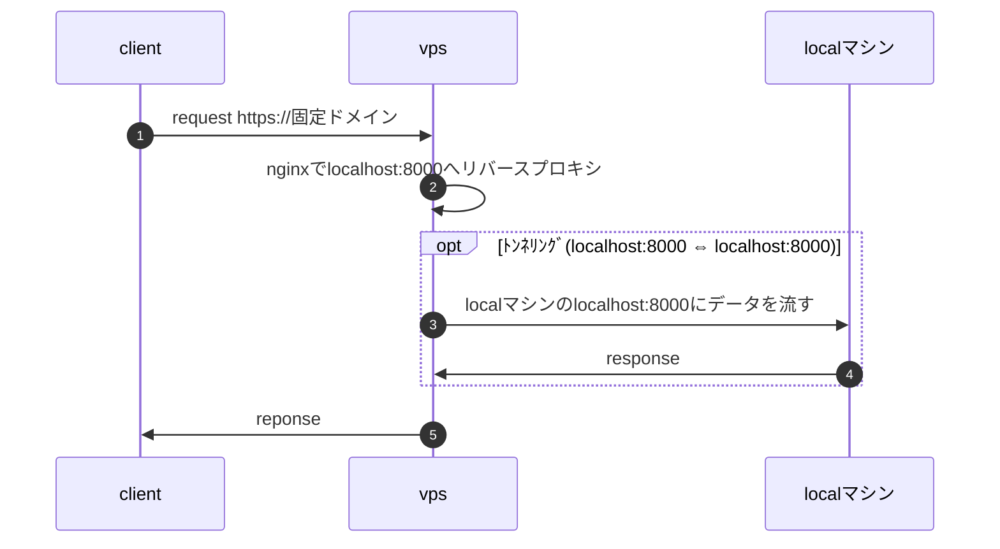

# はじめに
個人開発で外部トンネリングサービス等を使わずにlocalhostとの紐づけをしたので共有します。

web開発は`ssl化された固定ドメインでweb公開されている状態`で開発したいと思う方が多いと思います。
その理由は外部サービスやブラウザ側で用意されているapiを叩く際にssl化された固定ドメインでないと動かなかったり、スマホで動作確認したいような場面によく遭遇するからです。
ngrokのようなトンネリングサービスを使うと手っ取り早く解決しますが月10$とそれなりにお金がかかってしまい、個人開発のような売上度外視でやっているとためらってしまいます。
またvercelのようなホスティングサービスを使えば簡単にssl化された固定ドメインを無料でweb公開ができますが、3アプリまでしか作れなかったりと制限があり自由に開発できないので選びませんでした。

で、上記の`お金をかけずに自由に開発ができる点を重視`して`ssl化された固定ドメインとlocalhostの紐づけ`を行いました。

# 前提条件
- vpsを所有している。
- トンネリング用のドメインを取得済。
- dnsの設定でドメインの参照先をvpsに向けている。

# アーキテクチャ


やっている事はVPS内のnginxで固定ドメインへのリクエストをlocalhost:8000にリバースプロキシして、VPSのlocalhost:8000とローカルマシンのlocalhost:8000をトンネリングし繋げて、固定ドメインとローカルマシンのlocalhost:8000を繋げています。

ローカルマシンとVPSは常に繋がっているわけではなくローカルマシンからのあるコマンド1つでトンネリングするようにしているので、ネットワークが違う外出先や自宅でもコマンド1つで固定ドメインとローカルホストを繋げる事ができます。

VPSの中では上記のアーキテクチャと作ったアプリを混在させています。
少しゴチャっとしますがお金をかけたくないので妥協します。

# VPS側の設定
## nginx
リバースプロキシを使って固定ドメインからのリクエストをlocalhost:8000に転送します。
開発中に他人に見られては困るのでallowとdenyで自身のグローバルIPのみアクセス許可をするように設定しました。
sslの設定はCertbotで自動生成するのでここでは書きません。

```bash:/etc/nignx/conf.d/xxx-example-com.conf
server {
    server_name xxx.example.com;
    listen 80;
    listen [::]:80;

    access_log /var/log/nginx/xxx-example-com/access.log;
    error_log /var/log/nginx/xxx-example-com/error.log error;

    allow xx.xx.xx.xx;  # 自宅IP
    deny all;

    location / {
        proxy_pass http://localhost:8000;
        proxy_set_header Host $host;
        proxy_set_header X-Real-IP $remote_addr;
    }
}
```

## 固定ドメインのSSL化
Certbotを使って固定ドメインのSSL化を行います。
Certbotは無料かつ自動でSSL証明書を発行できるツールです。
```bash
sudo apt install certbot
```

以下のコマンドで証明書が発行されます。
```bash
sudo certbot --nginx -d xxx.example.com
```

証明書発行後にnginxのconfファイルが自動的に書き換わります。
```bash:/etc/nignx/conf.d/xxx-example-com.conf
server {
    server_name xxx.example.com;

    access_log /var/log/nginx/xxx-example-com/access.log;
    error_log /var/log/nginx/xxx-example-com/error.log error;

    allow xx.xx.xx.xx;  # 自宅IP
    deny all;

    location / {
        proxy_pass http://localhost:8000;
        proxy_set_header Host $host;
        proxy_set_header X-Real-IP $remote_addr;
    }

    listen [::]:443 ssl ipv6only=on; # managed by Certbot
    listen 443 ssl; # managed by Certbot
    ssl_certificate /etc/letsencrypt/live/xxx.example.com/fullchain.pem; # managed by Certbot
    ssl_certificate_key /etc/letsencrypt/live/xxx.example.com/privkey.pem; # managed by Certbot
    include /etc/letsencrypt/options-ssl-nginx.conf; # managed by Certbot
    ssl_dhparam /etc/letsencrypt/ssl-dhparams.pem; # managed by Certbot

}
server {
    if ($host = xxx.example.com) {
        return 301 https://$host$request_uri;
    } # managed by Certbot

    server_name xxx.example.com;
    listen 80;
    listen [::]:80;
    return 404; # managed by Certbot

}
```

# ローカマシン側の設定
## vpsとローカルマシンをリモートフォワードで繋げる
sshのリモートフォワード機能を使ってVPS側のlocalhost:8000とローカルマシン側のlocalhost:8000をリモートフォワードで繋げます。
長時間接続がない場合にリモートフォワードが切断されないようにするかどうかはお好みで設定してください。

```bash:~/.ssh/config
Host xserver-xxx-example-com
  HostName xxx.xxx.xxx.xxx
  IdentityFile ~/.ssh/xxx.pem
  User ubuntu
  RemoteForward 8000 localhost:8000
  ServerAliveInterval 60  #通信が長時間ない場合に切断されないようにする
  ServerAliveCountMax 5   #通信が長時間ない場合に切断されないようにする
```

あとは以下のコマンドを好きなタイミングで実行すればそのマシンが所属しているネットワークのlocalhost:8000とssl化された固定ドメインが紐づくようになります。
```bash
ssh -N xserver-xxx-example-com
```

# おわりに
1つのvps内で色々やらせ過ぎ感がありますが無料で公開しているようなゆるい個人開発ならこんなんでもいいんじゃないでしょうか。

どこかの誰かの参考になれば幸いです。