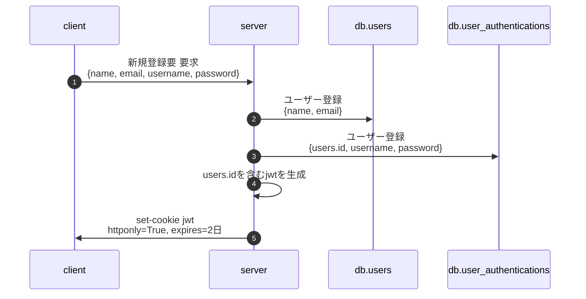
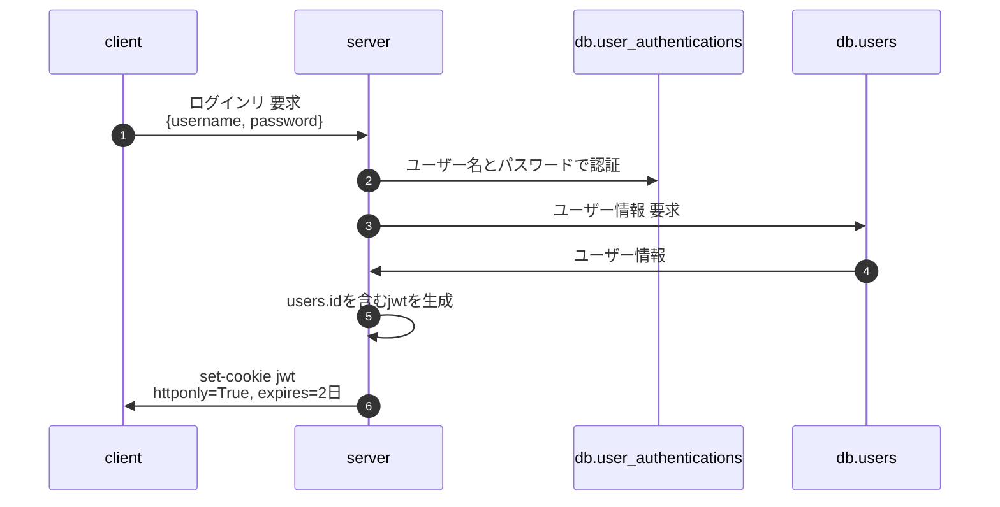
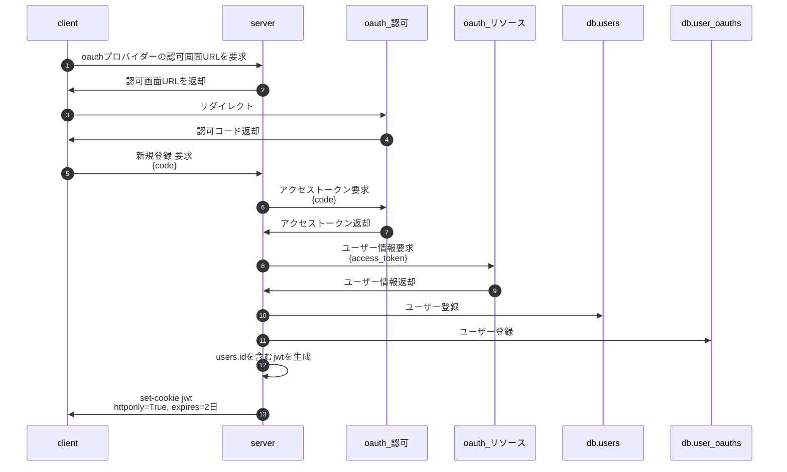
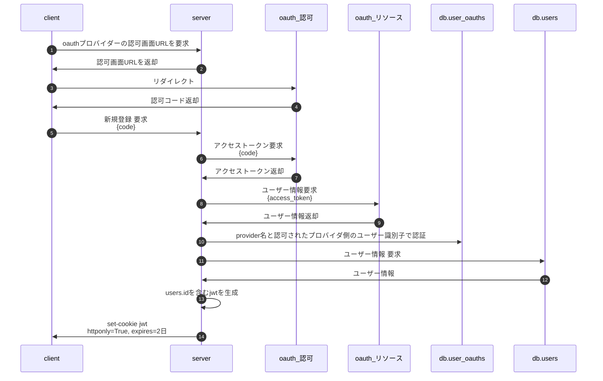

# はじめに
一般的なユーザー名とパスワードを使った認証とoauth2を使った認証の組み合わせたサーバー側の設計のメモです。

以降は「ユーザー名とパスワードを使った認証」を「パスワード認証」 とします。

# 全体的な考え方
認証方式をあまり意識したくないので認証後はサーバー側がユーザーの識別子を含むjwtを発行する。
サーバーはリクエスト内に含まれるjwtを検証して認証済かどうかの判断を行う。
新規登録とログインの処理はパスワード認証用とoauth2用で2つ作る必要あり。
oauth2のアクセストークンとリフレッシュトークンは保持しない。使ったらすぐに破棄(こわいので)

# table定義
## users
ユーザーの基本情報
|  id  |  name  |  email  |
| ---- | ---- | ---- |
|  1  |  佐藤学  |  satomanabu@manabun.com  |

## user_authentications
パスワード認証用の情報
|  id  |  user_id   |  username  |  password  |
| ---- | ---- | ---- | ---- |
|  1  |  1  |  manabu  |  51fd726f3d3f93f8d436b7e6c060...  |

## user_oauths
oauth2で認証を行うための情報
|  id  |  user_id   |  provider  |  identity  |
| ---- | ---- | ---- | ---- |
|  1  |  1  |  google  |  10001  |

provider = oauthのプロバイダ名
identity = 認可されたプロバイダ側のユーザー識別子(user_idとか)

# パスワード認証のフロー
## 新規登録

## ログイン

# oauth2認証のフロー
## 新規登録

## ログイン
リソースサーバーからユーザー情報を取得するまでは新規登録と同じ。

# おわりに
多分これで問題ないと思うけどどうなんでしょう・・・