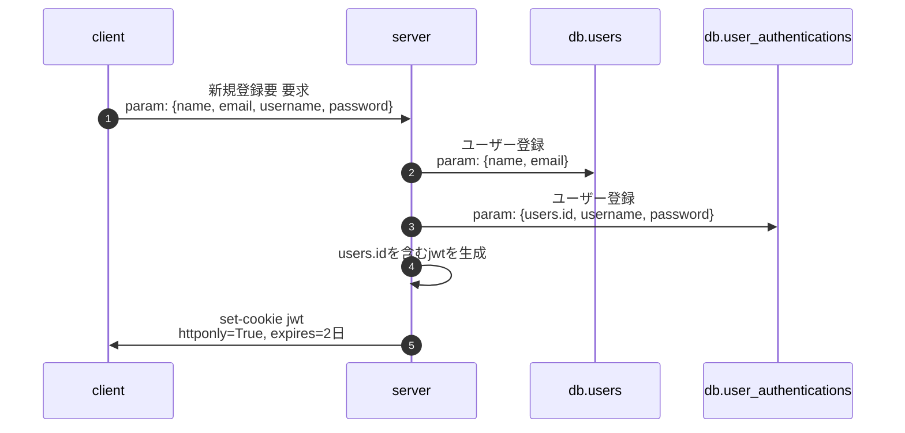
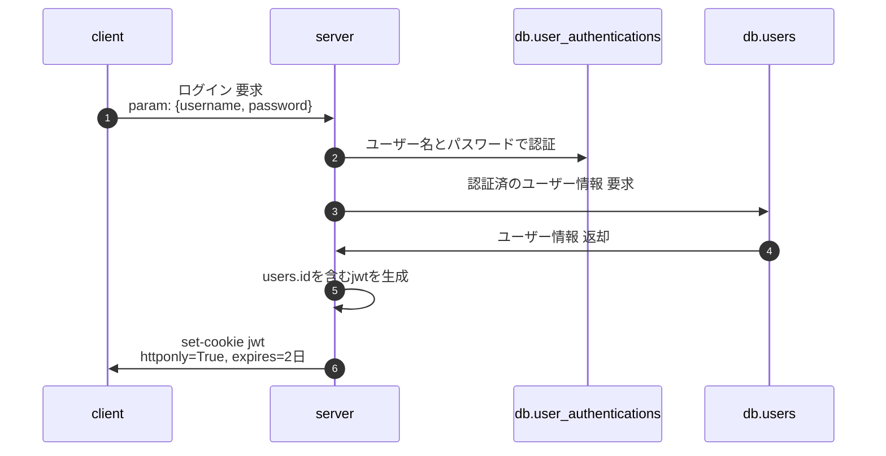
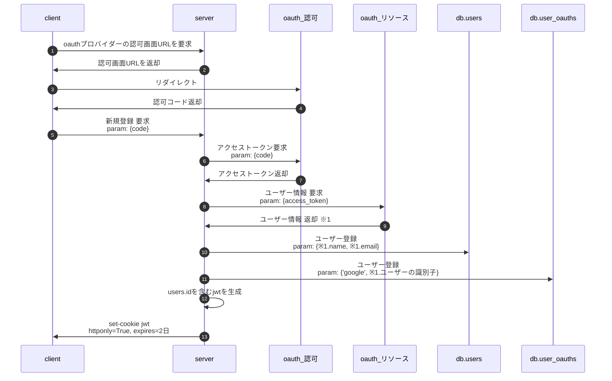
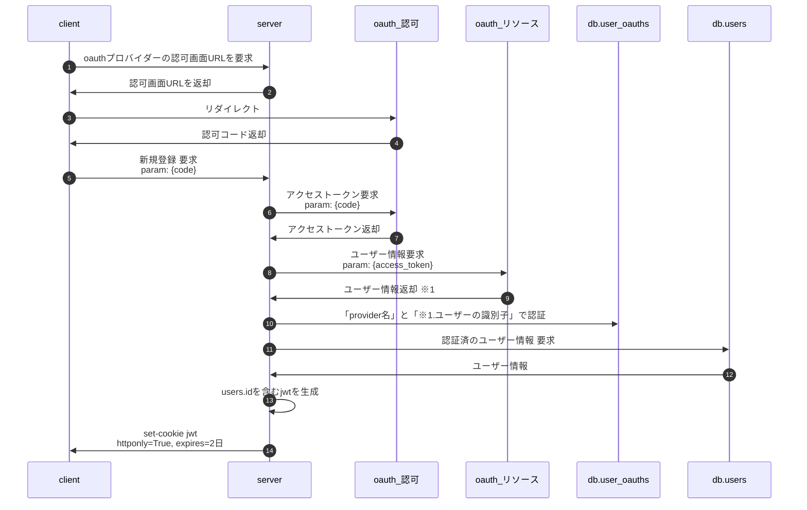
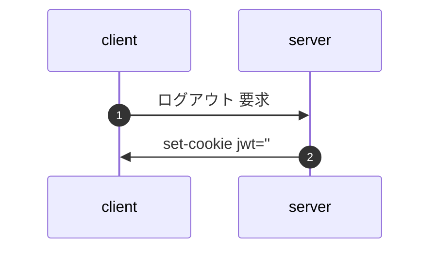

# はじめに
パスワード認証とソーシャル認証を組み合わせたサーバー側の設計メモです。
※「一般的なユーザー名とパスワードを使った認証」を「パスワード認証」 と略しています。

flaskで実装したサンプル
https://github.com/ritogk/social-login-sample

# 全体的な考え方
アプリケーション全体で認証方式を意識したくないので認証後はサーバー側が認証情報(ユーザーの識別子を含むjwt)を発行する。
サーバーはリクエスト内に含まれるjwtを検証して認証済かどうかの判断を行う。
新規登録とログイン処理はパスワード認証用とソーシャル認証用で2つ作る必要あり。
ソーシャル認証時のアクセストークンとリフレッシュトークンは保持しない。使ったらすぐに破棄(こわいので)

# table定義
## users
ユーザーの基本情報
ソーシャル認証の場合はoauthプロバイダーから取得したユーザー情報が入る
|  id  |  name  |  email  |
| ---- | ---- | ---- |
|  1  |  佐藤学  |  satomanabu@manabun.com  |

## user_authentications
パスワード認証用の情報
|  id  |  user_id   |  username  |  password  |
| ---- | ---- | ---- | ---- |
|  1  |  1  |  manabu  |  51fd726f3d3f93f8d436b7e6c060...  |

## user_oauths
ソーシャル認証用の情報
|  id  |  user_id   |  provider  |  identity  |
| ---- | ---- | ---- | ---- |
|  1  |  1  |  google  |  10001  |

provider = oauthのプロバイダ名
identity = 認可されたプロバイダ側のユーザー識別子(user_idとか)

# パスワード認証のフロー
## 新規登録

## ログイン

# oauth2認証のフロー
## 新規登録

## ログイン

# ログアウト(パスワード認証、oauth2認証で共通)

# おわりに
多分これで問題ないと思うですけどどうなんでしょ・・・・